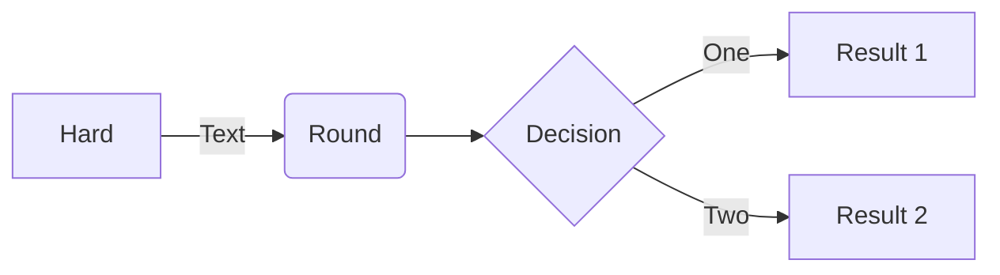

# Monocart Reporter

[](https://www.npmjs.com/package/monocart-reporter)
[](https://www.npmjs.com/package/monocart-reporter)


* A [Playwright](https://github.com/microsoft/playwright) Test [Reporter](https://playwright.dev/docs/test-reporters) (Node.js)
    - A `Tree Grid` style test reporter
    - Support processing big data with high performance
    - Design for customization and extensibility
    - Interactive report with grouping and ultra-fast filter
    - Timeline Workers Graph
    - Monitor CPU and Memory Usage
    - Export Data (json)
* [Preview](#preview)
* [Install](#install)
* [Playwright Config](#playwright-config)
* [Examples](#examples)
* [Output](#output)
* [Reporter Options](#reporter-options)
* [View Trace Online](#view-trace-online)
* [Custom Fields Report](#custom-fields-report)
    * [Custom Columns](#custom-columns)
        - [Column Formatter](#column-formatter)
        - [Searchable Fields](#searchable-fields)
    * [Custom Fields in Comments](#custom-fields-in-comments)
        - [Create Diagrams and Visualizations with Mermaid](#create-diagrams-and-visualizations-with-mermaid)
    * [Custom Fields with `setMetadata()`](#custom-fields-with-setmetadata)
    * [Custom Data Visitor](#custom-data-visitor)
        - [Collect Data from the Title](#collect-data-from-the-title)
        - [Collect Data from the Annotations](#collect-data-from-the-annotations)
        - [Remove Secrets and Sensitive Data](#remove-secrets-and-sensitive-data)
* [Style Tags](#style-tags)
* [Metadata](#metadata)
* [Trend Chart](#trend-chart)
* [Code Coverage Report](#code-coverage-report)
    - [Global Coverage Report](#global-coverage-report)
    - [Coverage Options](#coverage-options)
    - [Coverage Examples](#coverage-examples)
* [Attach Lighthouse Audit Report](#attach-lighthouse-audit-report)
* [Attach Network Report](#attach-network-report)
* [Global State Management](#global-state-management)
    - [Setup Global State](#setup-global-state)
    - [Get, Set, and Remove Global Data](#get-set-and-remove-global-data)
    - [Send and Receive Messages between Processes](#send-and-receive-messages-between-processes)
* [Merge Shard Reports](#merge-shard-reports)
* [onEnd Hook](#onend-hook)
* [Integration Examples](#integration-examples)
* [Contributing](#contributing)
* [Changelog](CHANGELOG.md)


## Preview
[https://cenfun.github.io/monocart-reporter](https://cenfun.github.io/monocart-reporter)


(For Github actions, we can enforce color with env: `FORCE_COLOR: true`)

## Install
```sh
npm i -D monocart-reporter
```

## Playwright Config
> Note: Most examples use `CommonJS` by default, please [move to ESM](https://gist.github.com/sindresorhus/a39789f98801d908bbc7ff3ecc99d99c#how-can-i-move-my-commonjs-project-to-esm) according to your needs.
```js
// playwright.config.js
module.exports = {
    reporter: [
        ['list'],
        ['monocart-reporter', {  
            name: "My Test Report",
            outputFile: './monocart-report/index.html'
        }]
    ]
};
```
Playwright Docs [https://playwright.dev/docs/test-reporters](https://playwright.dev/docs/test-reporters)

## Examples
- [tests](/tests/)
- [monocart-reporter-examples](https://github.com/cenfun/monocart-reporter-examples)
- [playwright-reporter-integrations](https://github.com/cenfun/playwright-reporter-integrations)

## Output
- path-to/your-filename.html  
Single HTML file (data compressed), easy to transfer/deploy or open directly anywhere   
> Note: All attachments (screenshots images/videos) will be linked with relative path in report.
- path-to/your-filename.json  (requires option `json` is true)
Separated data file which can be used for debugging or data provider (It's included in the above HTML and compressed).
- path-to/your-filename.zip  (requires option `zip` is true)
Zip file for merging reports

## Reporter Options
- Default options: [lib/default/options.js](./lib/default/options.js)
- Options declaration see `MonocartReporterOptions` [lib/index.d.ts](./lib/index.d.ts)

## View Trace Online 
> The [Trace Viewer](https://trace.playwright.dev/) requires that the trace file must be loaded over the http:// or https:// protocols without [CORS](https://developer.mozilla.org/en-US/docs/Glossary/CORS) issue.
- Start a local web server with following CLI:
```sh
# serve and open report
npx monocart show-report <path-to-report>

# serve report
npx monocart serve-report <path-to-report>
```
The server add the http header `Access-Control-Allow-Origin: *` to [allow requesting from any origin](https://developer.mozilla.org/en-US/docs/Web/HTTP/Headers/Access-Control-Allow-Origin), it works with `http://localhost:port/` or `http://127.0.0.1:port/`
- To successfully work with other `IP` or `domain`, you can start web server with `https`:
```sh
npx monocart show-report <path-to-report> --ssl <path-to-key,path-to-cert>
```
For example: `npx monocart show-report monocart-report/index.html --ssl ssl/key.pem,ssl/cert.pem`

You can create and install local CA with [mkcert](https://mkcert.dev)
- Using your own trace viewer url with option `traceViewerUrl`:
```js
// reporter options
{
    name: "My Test Report",
    outputFile: './monocart-report/index.html',
    // defaults to 'https://trace.playwright.dev/?trace={traceUrl}'
    traceViewerUrl: 'https://your-own-trace-viewer-url/?trace={traceUrl}'
}
```

## Custom Fields Report
You can add custom fields to the report. for example: Owner, JIRA Key etc.
- First, you need to add [Custom Columns](#custom-columns) for the fields.
- Then, collect data for these fields
    - [Custom Fields in Comments](#custom-fields-in-comments)
    - [Custom Fields with `setMetadata()`](#custom-fields-with-setmetadata)
    - [Custom Data Visitor](#custom-data-visitor)

### Custom Columns
The report will be displayed in a `Tree Grid`. The `columns` function is used to customize the grid columns. The column properties following:
- `id` (String) Column id (required)
- `name` (String) Column name, shows in grid header
- `align` (String) left (default), center, right
- `width` (Number) Column width
- `minWidth`, `maxWidth` (Number) Default to 81 ~ 300
- `styleMap` (Object, String) Column style (css)
- `formatter` (Function) [column formatter](#custom-formatter). Arguments: value, rowItem, columnItem, cellNode
- `sortable` (Boolean) Column sortable when click column header name
- `resizable` (Boolean) Column width resizable
- `searchable` (Boolean) Specifies whether the column is searchable
- `markdown` (Boolean) Specifies whether the column needs to use markdown conversion
- `detailed` (Boolean) Specifies whether the column needs to display the layout in detail (horizontal)
- more properties [columnProps](https://cenfun.github.io/turbogrid/api.html#options.columnProps)
```js
// playwright.config.js
module.exports = {
    reporter: [
        ['monocart-reporter', {  
            name: "My Test Report",
            outputFile: './monocart-report/index.html',

            // custom columns
            columns: (defaultColumns) => {

                // insert custom column(s) before a default column
                const index = defaultColumns.findIndex((column) => column.id === 'duration');
                defaultColumns.splice(index, 0, {
                    // define the column in reporter
                    id: 'owner',
                    name: 'Owner',
                    align: 'center',
                    searchable: true,
                    styleMap: {
                        'font-weight': 'normal'
                    }
                }, {
                    // another column for JIRA link
                    id: 'jira',
                    name: 'JIRA Key',
                    width: 100,
                    searchable: true,
                    styleMap: 'font-weight:normal;',
                    formatter: (v, rowItem, columnItem) => {
                        const key = rowItem[columnItem.id];
                        return `<a href="https://your-jira-url/${key}" target="_blank">${v}</a>`;
                    }
                });

            }
        }]
    ]
};
```
#### Column Formatter
> Note: The `formatter` function will be serialized into string via JSON, so closures, contexts, etc. will not work!
```js
// playwright.config.js
module.exports = {
     reporter: [
        ['monocart-reporter', {  
            name: "My Test Report",
            outputFile: './monocart-report/index.html',
            columns: (defaultColumns) => {

                // duration formatter
                const durationColumn = defaultColumns.find((column) => column.id === 'duration');
                durationColumn.formatter = function(value, rowItem, columnItem) {
                    if (typeof value === 'number' && value) {
                        return `<i>${value.toLocaleString()} ms</i>`;
                    }
                    return value;
                };

                // title formatter
                // Note: The title shows the tree style, it is a complicated HTML structure
                // it is recommended to format title base on previous.
                const titleColumn = defaultColumns.find((column) => column.id === 'title');
                titleColumn.formatter = function(value, rowItem, columnItem, cellNode) {
                    const perviousFormatter = this.getFormatter('tree');
                    const v = perviousFormatter(value, rowItem, columnItem, cellNode);
                    if (rowItem.type === 'step') {
                        return `${v}<div style="position:absolute;top:0;right:5px;">✅</div>`;
                    }
                    return v;
                };

            }
        }]
    ]
};
```

#### Searchable Fields
```js
// playwright.config.js
module.exports = {
     reporter: [
        ['monocart-reporter', {  
            name: "My Test Report",
            outputFile: './monocart-report/index.html',
            columns: (defaultColumns) => {
                const locationColumn = defaultColumns.find((column) => column.id === 'location');
                locationColumn.searchable = true;
            }
        }]
    ]
};
```

### Custom Fields in Comments
> The code comments are good enough to provide extra information without breaking existing code, and no dependencies, clean, easy to read, etc. 
- First, enable option `customFieldsInComments` to `true`
```js
// playwright.config.js
module.exports = {
    reporter: [
        ['monocart-reporter', {  
            // enable/disable custom fields in comments. Defaults to true.
            customFieldsInComments: true
        }]
    ]
};
```

- Then, add comments for the tests
> Note: Each comment item must start with `@` which is similar to [JSDoc](https://jsdoc.app/).

For example, adding `owner` and `jira` to the cases, steps, and suites. or updating the value if the field exists like `title`
```js
/**
 * for file (comment file in the first line)
 * @owner FO
 */
const { test, expect } = require('@playwright/test');

/**
 * for case
 * @owner Kevin
 * @jira MCR-16888
 */
test('case title', () => { 

});

/**
 * @description multiple lines text description
multiple lines text description
multiple lines text description
 * @jira MCR-16888
*/
test('case description', () => {

});

/**
 * for describe suite
 * @owner Mark
 * @jira MCR-16900
 */
test.describe('suite title', () => {

    test('case title', ({ browserName }, testInfo) => {

        /**
         * rewrite assert step title "expect.toBe" to
         * @title my custom assert step title
         * @annotations important
         */
        expect(testInfo).toBe(test.info());

        // @owner Steve
        await test.step('step title', () => {
        
        });

    });

});

/**
 * rewrite "beforeAll hook" title to
 * @title do something before all
 */
test.beforeAll(() => { 

});

/**
 * rewrite "beforeEach hook" title to
 * @title do something before each
 */
test.beforeEach(() => { 
    
});
```

#### Create Diagrams and Visualizations with [Mermaid](https://mermaid.js.org/)
- Enable Mermaid 
```js
// playwright.config.js
module.exports = {
     reporter: [
        ['monocart-reporter', {  
            name: "My Test Report",
            outputFile: './monocart-report/index.html',
            mermaid: {
                // mermaid script url, using mermaid CDN: https://www.jsdelivr.com/package/npm/mermaid
                scriptSrc: 'https://cdn.jsdelivr.net/npm/mermaid@latest/dist/mermaid.min.js',
                // mermaid config: https://mermaid.js.org/config/schema-docs/config.html
                config: {
                    startOnLoad: false
                }
            }
        }]
    ]
};
```
- Write Mermaid code in markdown:
````js
/**
 * @description Sequence diagram for Monocart Reporter

*/
test('case description', () => {

});
````
see [Mermaid doc](https://mermaid.js.org/syntax/flowchart.html)


### Custom Fields with `setMetadata()`
Using `comments` is only applicable to statically created tests, while using API `setMetadata()` can be applicable to all situations, which is including dynamically created tests.
```js
const { test } = require('@playwright/test');
const { setMetadata } = require('monocart-reporter');
test.describe('Data Driven Tests with setMetadata(data, testInfo)', () => {
    const list = [{
        title: 'Example Case 1 Data Driven Test',
        owner: 'Jensen',
        jira: 'MCR-16889',
    }, {
        title: 'Example Case 2 Data Driven Test',
        owner: 'Mark',
        jira: 'MCR-16899'
    }];
    list.forEach((item, i) => {
        test(item.title, () => {
            setMetadata({
                owner: item.owner,
                jira: item.jira
            }, test.info());

            //expect(1).toBe(1);

        });
    });
});
```

### Custom Data Visitor
The `visitor` function will be executed for each row item (suite, case and step). Arguments:
- `data` data item (suite/case/step) for reporter, you can rewrite some of its properties or add more
- `metadata` original data object from Playwright test, could be one of [Suite](https://playwright.dev/docs/api/class-suite), [TestCase](https://playwright.dev/docs/api/class-testcase) or [TestStep](https://playwright.dev/docs/api/class-teststep)

#### Collect Data from the Title
For example, we want to parse out the jira key from the title:
```js
test('[MCR-123] collect data from the title', () => {

});
```
You can simply use regular expressions to parse and get jira key:
```js
// playwright.config.js
module.exports = {
    reporter: [
        ['monocart-reporter', {  
            name: "My Test Report",
            outputFile: './monocart-report/index.html',
            visitor: (data, metadata) => {
                // [MCR-123] collect data from the title
                const matchResult = metadata.title.match(/\[(.+)\]/);
                if (matchResult && matchResult[1]) {
                    data.jira = matchResult[1];
                }
            }
        }]
    ]
};
```
multiple matches example: [collect-data](https://github.com/cenfun/monocart-reporter-examples/tree/main/tests/collect-data)

#### Collect Data from the Annotations
It should be easier than getting from title. see [custom annotations](https://playwright.dev/docs/test-annotations#custom-annotations) via `test.info().annotations`
```js
test('collect data from the annotations', () => {
    test.info().annotations.push({
        type: "jira",
        description: "MCR-123"
    })
});
```
```js
// playwright.config.js
module.exports = {
    reporter: [
        ['monocart-reporter', {  
            name: "My Test Report",
            outputFile: './monocart-report/index.html',
            visitor: (data, metadata) => {
                // collect data from the annotations
                if (metadata.annotations) {
                    const jiraItem = metadata.annotations.find((item) => item.type === 'jira');
                    if (jiraItem && jiraItem.description) {
                        data.jira = jiraItem.description;
                    }
                }
            }
        }]
    ]
};
```

#### Remove Secrets and Sensitive Data
> The report may hosted outside of the organization’s internal boundaries, security becomes a big issue. Any secrets or sensitive data, such as usernames, passwords, tokens and API keys, should be handled with extreme care. The following example is removing the password and token from the report data with the string replacement in `visitor` function.
```js
// playwright.config.js
module.exports = {
    reporter: [
        ['monocart-reporter', {  
            name: "My Test Report",
            outputFile: './monocart-report/index.html',
            visitor: (data, metadata) => {
                const mySecrets = [process.env.PASSWORD, process.env.TOKEN];
                mySecrets.forEach((secret) => {
                    // remove from title
                    data.title = data.title.replace(secret, '***');
                    // remove from logs
                    if (data.logs) {
                        data.logs = data.logs.map((item) => item.replace(secret, '***'));
                    }
                    // remove from errors
                    if (data.errors) {
                        data.errors = data.errors.map((item) => item.replace(secret, '***'));
                    }
                });
            }
        }]
    ]
};
```
see example: [remove-secrets](https://github.com/cenfun/monocart-reporter-examples/tree/main/tests/remove-secrets)

## Style Tags

* Add tag to test/describe title ( starts with `@` )
```js
test('test title @smoke @critical', () => { });
test.describe('describe title @smoke @critical', () => { });

// new syntax for tag in playwright v1.42.0
test('test title', { tag: ['@smoke', '@critical'] }, () => { });
test.describe('describe title', { tag: ['@smoke', '@critical'] }, () => { });
```

* Custom tag style
```js
// playwright.config.js
module.exports = {
    reporter: [
        ['monocart-reporter', {  
            name: "My Test Report",
            outputFile: './monocart-report/index.html',
            tags: {
                smoke: {
                    style: {
                        background: '#6F9913'
                    },
                    description: 'This is Smoke Test'
                },
                critical: {
                    background: '#c00'
                }
            }
        }]
    ]
};
```

* Put style tags in new column
```js
module.exports = {
    reporter: [
        ['list'],
        ['monocart-reporter', {  
            name: "My Test Report",
            outputFile: './monocart-report/index.html',
            tags: {
                // ...
            },
            columns: (defaultColumns) => {

                // disable title tags
                defaultColumns.find((column) => column.id === 'title').titleTagsDisabled = true;

                // add tags column
                const index = defaultColumns.findIndex((column) => column.id === 'type');
                defaultColumns.splice(index, 0, {
                    id: 'tags',
                    name: 'Tags',
                    width: 150,
                    formatter: 'tags'
                });
            }
        }]
    ]
};
```
see [example](https://github.com/cenfun/monocart-reporter-examples/tree/main/tests/tags-column)


## Metadata
> All metadata will be listed in the report in a key/value format.
- Global level `metadata`
```js
// playwright.config.js
module.exports = {
    globalSetup: require.resolve('./common/global-setup.js'),
    metadata: {
        product: 'Monocart',
        env: 'STG',
        type: 'Regression',
        executor: 'Mono',
        
        // test home page object model
        url: 'https://www.npmjs.org/package/monocart-reporter'
    },
     reporter: [
        ['monocart-reporter', {  
            name: "My Test Report",
            outputFile: './monocart-report/index.html'
        }]
    ]
};
```

- Project level `metadata`
```js
// playwright.config.js
module.exports = {
    projects: [
        {
            name: 'Desktop Chromium',
            use: {
                browserName: 'chromium'
            },
            metadata: {
                projectData: 'project level metadata',
                owner: 'PO',
                link: 'https://github.com/cenfun/monocart-reporter'
            }
        }
    ]
}
```

- Collect metadata in [global setup or teardown](https://playwright.dev/docs/test-global-setup-teardown)
```js
// ./common/global-setup.js
import { chromium } from '@playwright/test';
export default async (config) => {
    const metadata = config.metadata;
    // collect data and save to global metadata
    const browser = await chromium.launch();
    const chromiumVersion = await browser.version();
    metadata.chromiumVersion = chromiumVersion;
};
```

- Collect metadata in a test
    > Playwright Test runs tests in [parallel](https://playwright.dev/docs/test-parallel) with isolate test data by default, so we need to utilize [global state management](#global-state-management) to collect metadata in a test.

    - Enable global state, see [Setup Global State](#setup-global-state)
    - Update global state in a test
    ```js
    const { test } = require('@playwright/test');
    const { useState } = require('monocart-reporter');

    const state = useState({
        // port: 8130
    });

    test('test metadata url', async ({ page }) => {
        const url = await page.evaluate(() => window.location.href);
        await state.set('url', url);
    });
    ```

## Trend Chart
> Note: The trend chart requires historical data generally stored in the server database. There is a serverless solution which is connecting and collecting historical trend data from previous report data before test every time.
- If a report is generated in the same place every time, you can simply connect the data with the report JSON path (the data is not 100% safe if there is any runtime error, the previous output dir will be empty by Playwright but the reporter processing not finish)
```js
// playwright.config.js
module.exports = {
    reporter: [
        ['monocart-reporter', {  
            name: "My Test Report",
            outputFile: './monocart-report/index.html',
            // connect previous report data for trend chart
            trend: './monocart-report/index.json'
        }]
    ]
};
```
- Recommended: resolve the data by yourself (could be requested from the server), required data fields: 
    - `date` (Number) the previous test date in milliseconds
    - `duration` (Number) the previous test duration
    - `summary` (Object) the previous test summary 
    - `trends` (Array) historical data list, but except the previous self
```js
// playwright.config.js
module.exports = {
    reporter: [
        ['monocart-reporter', {  
            name: "My Test Report",
            outputFile: './monocart-report/index.html',
            // connect previous report data for trend chart
            trend: async () => {
                const previousReportData = await readDataFromSomeWhere("path-to/report.json");
                // do some data filtering to previous trends
                previousReportData.trends = previousReportData.trends.filter((item) => {
                    // remove data a week ago
                    return item.date > (Date.now() - 7 * 24 * 60 * 60 * 1000)
                });
                return previousReportData;
            }
        }]
    ]
};
```

## Code Coverage Report
The reporter integrates [monocart-coverage-reports](https://github.com/cenfun/monocart-coverage-reports) for coverage reports, there are two APIs:
- `addCoverageReport(data, testInfo)` Add coverage to global coverage report from a test. see [Global Coverage Report](#global-coverage-report)
    - `data` There are two supported data inputs: [Istanbul](https://github.com/cenfun/monocart-coverage-reports?#collecting-istanbul-coverage-data) (Object) or [V8](https://github.com/cenfun/monocart-coverage-reports?#collecting-v8-coverage-data) (Array)
    - `testInfo` see [TestInfo](https://playwright.dev/docs/api/class-testinfo)
- `attachCoverageReport(data, testInfo, options)` Attach a coverage report to a test. Arguments:
    - `data` same as above
    - `testInfo` same as above
    - `options` (Object) see [Coverage Options](#coverage-options)


### Global Coverage Report
The global coverage report will merge all coverages into one global report after all the tests are finished. 
- The global coverage options see [Coverage Options](#coverage-options)
```js
// playwright.config.js
module.exports = {
    reporter: [
        ['monocart-reporter', {  
            name: "My Test Report",
            outputFile: './monocart-report/index.html',
            // global coverage report options
            coverage: {
                entryFilter: (entry) => true,
                sourceFilter: (sourcePath) => sourcePath.search(/src\/.+/) !== -1,
            }
        }]
    ]
};
```
- Adding coverage data for each test with [automatic fixtures](https://playwright.dev/docs/test-fixtures#automatic-fixtures)
```js
// fixtures.js for v8 coverage
import { test as testBase, expect } from '@playwright/test';
import { addCoverageReport } from 'monocart-reporter';

const test = testBase.extend({
    autoTestFixture: [async ({ page }, use) => {

        // NOTE: it depends on your project name
        const isChromium = test.info().project.name === 'Desktop Chromium';

        // console.log('autoTestFixture setup...');
        // coverage API is chromium only
        if (isChromium) {
            await Promise.all([
                page.coverage.startJSCoverage({
                    resetOnNavigation: false
                }),
                page.coverage.startCSSCoverage({
                    resetOnNavigation: false
                })
            ]);
        }

        await use('autoTestFixture');

        // console.log('autoTestFixture teardown...');
        if (isChromium) {
            const [jsCoverage, cssCoverage] = await Promise.all([
                page.coverage.stopJSCoverage(),
                page.coverage.stopCSSCoverage()
            ]);
            const coverageList = [... jsCoverage, ... cssCoverage];
            // console.log(coverageList.map((item) => item.url));
            await addCoverageReport(coverageList, test.info());
        }

    }, {
        scope: 'test',
        auto: true
    }]
});
export { test, expect };
```
- Adding server side coverage on global teardown
> For example, a Node.js web server start at the beginning of the test with the env `NODE_V8_COVERAGE=dir`, the V8 coverage data will be saved to `dir` with calling API `v8.takeCoverage()` manually or terminating server gracefully. On global teardown, reading all from `dir` and adding them to global coverage report. For Node.js, the V8 coverage data requires appending source manually.
```js
// global-teardown.js
import fs from 'fs';
import path from 'path';
import { fileURLToPath } from 'url';
import { addCoverageReport } from 'monocart-reporter';

export default async (config) => {

    const dir = "your-v8-coverage-data-dir";

    const files = fs.readdirSync(dir);
    for (const filename of files) {
        const content = fs.readFileSync(path.resolve(dir, filename)).toString('utf-8');
        const json = JSON.parse(content);
        let coverageList = json.result;
        coverageList = coverageList.filter((entry) => entry.url && entry.url.startsWith('file:'));

        // appending source
        coverageList.forEach((entry) => {
            entry.source = fs.readFileSync(fileURLToPath(entry.url)).toString('utf8');
        });

        // there is no test info on teardown, just mock one with required config
        const mockTestInfo = {
            config
        };
        await addCoverageReport(coverageList, mockTestInfo);
    }
}
```
see [Collecting V8 Coverage Data from Node.js](https://github.com/cenfun/monocart-coverage-reports?#collecting-v8-coverage-data-from-nodejs)

### Coverage Options
- Default [options](https://github.com/cenfun/monocart-coverage-reports?#options)
- [Available Reports](https://github.com/cenfun/monocart-coverage-reports?#available-reports)
- [Using entryFilter and sourceFilter to filter the results for V8 report](https://github.com/cenfun/monocart-coverage-reports?#using-entryfilter-and-sourcefilter-to-filter-the-results-for-v8-report)
- Checking thresholds with [onEnd Hook](https://github.com/cenfun/monocart-coverage-reports?#onend-hook)
- More details see [monocart-coverage-reports](https://github.com/cenfun/monocart-coverage-reports)

### Coverage Examples
- For Playwright component testing:
    - [playwright-ct-vue](https://github.com/cenfun/playwright-ct-vue)
    - [playwright-ct-react](https://github.com/cenfun/playwright-ct-react)
    - [playwright-ct-svelte](https://github.com/cenfun/playwright-ct-svelte)
- [nextjs-with-playwright](https://github.com/cenfun/nextjs-with-playwright)
- [code-coverage-with-monocart-reporter](https://github.com/edumserrano/playwright-adventures/blob/main/demos/code-coverage-with-monocart-reporter/) 

## Attach Lighthouse Audit Report
Attach an audit report with API `attachAuditReport(runnerResult, testInfo)`. Arguments:
- `runnerResult` lighthouse result. see [lighthouse](https://github.com/GoogleChrome/lighthouse/tree/main/docs)
- `testInfo` see [TestInfo](https://playwright.dev/docs/api/class-testinfo)
```js
const { test, chromium } = require('@playwright/test');
const { attachAuditReport } = require('monocart-reporter');
const lighthouse = require('lighthouse/core/index.cjs');
test('attach lighthouse audit report', async () => {
    const port = 9222;
    const browser = await chromium.launch({
        args: [`--remote-debugging-port=${port}`]
    });
    const options = {
        // logLevel: 'info',
        // onlyCategories: ['performance', 'best-practices', 'seo'],
        output: 'html',
        port
    };
    const url = 'https://github.com/cenfun/monocart-reporter';
    const runnerResult = await lighthouse(url, options);
    await browser.close();
    await attachAuditReport(runnerResult, test.info());
});

```

## Attach Network Report
Attach a network report with API `attachNetworkReport(har, testInfo)`. Arguments:
- `har` HAR path (String) or HAR file buffer (Buffer). see [HAR 1.2 Spec](http://www.softwareishard.com/blog/har-12-spec/)
- `testInfo` see [TestInfo](https://playwright.dev/docs/api/class-testinfo)

 Generate HAR with `recordHar` option in browser.newContext() (see example: [report-network.spec.js](https://github.com/cenfun/monocart-reporter/blob/main/tests/report-network/report-network.spec.js) preview [report](https://cenfun.github.io/monocart-reporter/network-1a18723ee59b36867898/index.html))

```js
const fs = require('fs');
const path = require('path');
const { test } = require('@playwright/test');
const { attachNetworkReport } = require('monocart-reporter');
let context;
test.describe('attach network report 1', () => {

    const harPath = path.resolve('.temp/network-report1.har');
    if (fs.existsSync(harPath)) {
        // remove previous
        fs.rmSync(harPath);
    }

    test('first, open page', async ({ browser }) => {
        context = await browser.newContext({
            recordHar: {
                path: harPath
            }
        });
        const page = await context.newPage();
        await page.goto('https://github.com/cenfun/monocart-reporter');
    });

    test('next, run test cases', async () => {
        
    });

    test('finally, attach HAR', async () => {
        // Close context to ensure HAR is saved to disk.
        await context.close();
        await attachNetworkReport(harPath, test.info());
    });
});
```
Generate HAR with [playwright-har](https://github.com/janzaremski/playwright-har)
```js
import { test } from '@playwright/test';
import { attachNetworkReport } from 'monocart-reporter';
import { PlaywrightHar } from 'playwright-har';

const harPath = path.resolve('.temp/network-report2.har');
if (fs.existsSync(harPath)) {
    // remove previous
    fs.rmSync(harPath);
}

test('first, open page', async ({ browser }) => {
    const context = await browser.newContext();
    const page = await context.newPage();
    playwrightHar = new PlaywrightHar(page);
    await playwrightHar.start();
    await page.goto('https://github.com/cenfun/monocart-reporter');
});

test('next, run test cases', async () => {
    
});

test('finally, attach HAR', async () => {
    await playwrightHar.stop(harPath);
    await attachNetworkReport(harPath, test.info());
});
```
Preview [Network HTML Report](https://cenfun.github.io/monocart-reporter/network-da7f5b4cceb1e6280782/index.html)

## Global State Management
When tests are executed in [isolation](https://playwright.dev/docs/browser-contexts) mode, the reporter and each test may run in a different process, they cannot share data with each other. we can start a local WebSocket server to serve the global data, and read/write the global data with `useState` API from a test.
### Setup Global State
```js
module.exports = {
    reporter: [
        ['list'],
        ['monocart-reporter', {  
            name: "My Test Report",
            outputFile: './monocart-report/index.html',
            state: {
                data: {
                    count: 0
                },
                server: {
                    // port: 8130
                },
                onClose: (data, config) => {
                    // save state data to global metadata
                    Object.assign(config.metadata, data);
                }
            }
        }]
    ]
};
```
### Get, Set, and Remove Global Data
```js
const { test } = require('@playwright/test');
const { useState } = require('monocart-reporter');
test('state test', async ({ browserName }) => {
    const state = useState({
        // port: 8130
    });

    const count = await state.get('count');
    console.log('count', count);

    await state.set('count', count + 1);

    await state.set({
        browser: browserName,
        someKey: 'some value'
    });

    const [browser, someKey] = await state.get('browser', 'someKey');
    console.log(browser, someKey);

    await state.remove('someKey');

    const all = await state.get();
    console.log(all);
});
``` 
### Send and Receive Messages between Processes
- send message and receive response from a test (child process)
```js
const { test } = require('@playwright/test');
const { useState } = require('monocart-reporter');
test('state test send message', async () => {
    const state = useState({
        // port: 8130
    });
    const response = await state.send({
        testId: test.info().testId,
        data: 'my test data'
    });
    console.log('receive response on client', response);
});
``` 
- receive message and send response from global state (main process)
```js
module.exports = {
    reporter: [
        ['list'],
        ['monocart-reporter', {  
            name: "My Test Report",
            outputFile: './monocart-report/index.html',
            state: {
                onReceive: function(message) {
                    const test = this.getTest(message.testId);
                    if (test) {
                        // current test
                    }
                    console.log('receive message on server', message);
                    return {
                        data: 'my response data'
                    };
                }
            }
        }]
    ]
};
```
see example: [Allow specified test cases to run in sequence mode with lock/unlock state](https://github.com/cenfun/monocart-reporter-examples/tree/main/tests/global-state)

## Merge Shard Reports
There will be multiple reports to be generated if Playwright test executes in sharding mode. for example:
```sh
npx playwright test --shard=1/3
npx playwright test --shard=2/3
npx playwright test --shard=3/3
```
There are 3 reports will be generated. 

### Using `merge` API to merge all reports into one
> Note: One more suite level "shard" will be added, its title will be the machine hostname, and the summary will be restated. All attachments will be copied to the merged output directory.
```js
import { merge } from 'monocart-reporter';

// json file path
const reportDataList = [
    'path-to/shard1/index.json',
    'path-to/shard2/index.json',
    'path-to/shard3/index.json'

    // Or load zip file directly if the output files is zipped
    // 'path-to/shard1/index.zip',
    // 'path-to/shard2/index.zip',
    // 'path-to/shard3/index.zip'
];

await merge(reportDataList, {
    name: 'My Merged Report',
    outputFile: 'merged-report/index.html',
    onEnd: async (reportData, helper) => {
        // send email or third party integration
    }
});
```

> Note: The coverage reports will be merged automatically if we specify the `raw` report in coverage options:
```js
// global coverage options
coverage: {
    reports: [
        // for merging coverage reports
        'raw'
        // we can merge and zip the raw report files
        // ['raw', { merge: true, zip: true }]
    ]
}
```
see example [merge.js](https://github.com/cenfun/monocart-reporter-examples/blob/main/scripts/merge.js)

### Using `merge` CLI
```sh
npx monocart merge <glob-patterns>

# -o --outputFile
npx monocart merge path-to/shard*/index.json -o merged-reports/index.html

# -c --config
npx monocart merge path-to/shard*/my-report.zip -c mr.config.js

# NOTE: The asterisk(*) is a special character which is interpreted by some operating systems
# For example: Mac and Linux, please put it in quotes, but NOT for Windows
npx monocart merge 'path-to/shard*/*.zip'
```
The default config files (In order of priority)
- mr.config.js
- mr.config.cjs
- mr.config.mjs
- mr.config.json
- mr.config.ts

Preload for TypeScript config file:
- It requires node 18.19.0+
- Installing tsx: `npm i -D tsx`
- Using the `--import tsx` flag
- see [comment](https://github.com/cenfun/monocart-reporter/issues/145#issuecomment-2365460013)


## onEnd Hook
The `onEnd` function will be executed after report generated. Arguments:
- `reportData` all report data, properties:
    - `name` (String) report name 
    - `date` (Number) start date in milliseconds 
    - `dateH` (String) human-readable date with `Date.toLocaleString()` 
    - `duration` (Number) test duration in milliseconds 
    - `durationH` (String) human-readable duration
    - `summary` (Object) test summary, includes `tests`, `suites`, `steps`, etc.
    - `rows` and `columns` (Array) all rows and columns data, both are tree structure, see [detail](https://cenfun.github.io/turbogrid/api.html#data)
    - `tags` (Object) tag collection
    - `metadata` (Object) metadata collection
    - `system` (Object) system information
    - `trends` (Array) historical trend data
    - `caseTypes` and `suiteTypes` (Array)
    - `cwd`, `outputDir` and `outputFile` (String)
    - `htmlPath`, `jsonPath` and `summaryTable` (String)
    - ...
- `helper` APIs:
    - `helper.find(callback)` Find item like array `find` function.
    - `helper.filter(callback)` Filter list like array `filter` function.
    - `helper.forEach(callback)` Iterate all rows of data (suites/cases/steps), return `break` will break the iteration.
    - `helper.sendEmail(emailOptions)` 

```js
// playwright.config.js
module.exports = {
    reporter: [
        ['monocart-reporter', {  
            name: "My Test Report",
            outputFile: './monocart-report/index.html',
            // async hook after report data generated
            onEnd: async (reportData, helper) => {
                // console.log(reportData.summary);

                // find a test by title
                const myCase = helper.find((item, parent) => item.type === 'case' && item.title.includes('inline tag'));
                console.log(myCase && myCase.title);

                // find a suite by title
                const mySuite = helper.find((item, parent) => item.type === 'suite' && item.title.includes('new syntax'));
                console.log(mySuite && mySuite.title);

                // filter failed cases
                const failedCases = helper.filter((item, parent) => item.type === 'case' && item.caseType === 'failed');
                console.log(failedCases.map((it) => it.title));

                // Iterate all items
                helper.forEach((item, parent) => {
                    // do something
                });


            }
        }]
    ]
};
```

## Integration Examples
By using the `onEnd` hook, we can integrate Playwright report with any other tools, such as:
- [Email](https://github.com/cenfun/playwright-reporter-integrations/tree/main/send-email)
- [Testrail](https://github.com/cenfun/playwright-reporter-integrations/blob/main/testrail)
- [Qase](https://github.com/cenfun/playwright-reporter-integrations/tree/main/qase)
- [Jira + Zephyr](https://github.com/cenfun/playwright-reporter-integrations/tree/main/zephyr-scale)
- [Jira + Xray](https://github.com/cenfun/playwright-reporter-integrations/blob/main/xray)
- [Slack](https://github.com/cenfun/playwright-reporter-integrations/tree/main/slack-webhook)
- [Discord](https://github.com/cenfun/playwright-reporter-integrations/blob/main/discord-webhook)
- [Teams](https://github.com/cenfun/playwright-reporter-integrations/blob/main/teams-webhook)
- [BrowserStack](https://github.com/cenfun/playwright-reporter-integrations/blob/main/browserstack) 
- [Github Actions Summary](https://github.com/cenfun/playwright-reporter-integrations/blob/main/github-actions-summary)
- [Dingtalk](https://github.com/cenfun/playwright-reporter-integrations/tree/main/dingtalk-webhook)/[Weixin](https://github.com/cenfun/playwright-reporter-integrations/tree/main/weixin-webhook)/[Feishu](https://github.com/cenfun/playwright-reporter-integrations/tree/main/feishu-webhook)

See [playwright-reporter-integrations](https://github.com/cenfun/playwright-reporter-integrations)

## Contributing
```sh
# Node.js 20+
npm install starfall-cli -g
npm install

npm run build
npm run test

npm run dev
```
### Dependencies
- UI Framework [Vue 3](https://github.com/vuejs/core)
- Lightweight UI Components [vine-ui](https://github.com/cenfun/vine-ui)
- High Performance Grid [turbogrid](https://github.com/cenfun/turbogrid)
- String compress/decompress [lz-utils](https://github.com/cenfun/lz-utils)
- Coverage Reporter [monocart-coverage-reports](https://github.com/cenfun/monocart-coverage-reports)
